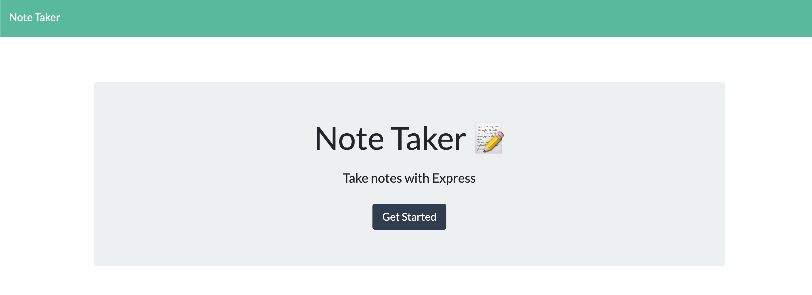

# Note Taker App🖥
  

  ---

  ## Description📒
```
For those who need to keep their tasks recorded. This app will allow you to enter a note and review it at a later time.
```

  ---

  ## Table Of Contents🗄
  - [Installation](#Installation⬇️) 
  - [Usage](#Usage📋)
  - [Contributors](#Contributors🧑‍💻👩‍💻)
  - [Future Contributions](#Future-Contributions💡)
  - [Sample](#Sample🎥)
  - [Questions](#Questions❔)
  - [License](#license🔐)

  ---

  ## Heroku
  
  You'll need to access the app on Heroku: (https://taking-notes-bellasantiago.herokuapp.com/)

  ---

  ## Usage📋
  
  Enter your task and save! You are then able to edit.


  ## Contributors🧑‍💻👩‍💻
  
  Bella Santiago
  
  ---

  ## Future Contributions💡

  For future contributions, please contact the owner.

  ---
  ## Sample🎥
  
  

  ---

  ## Questions❔

  If you have any questions, please contact me at bellasantiago.adl@gmail.com

  Have a look at my other projects at [GitHub](http://github.com/bellasantiago).

  ---
  ## License🔐
  
  This project is licensed under MIT.